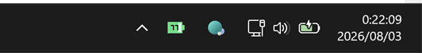

# usagebat

[English](README.md) | [日本語](README.ja.md)


usagebat keeps the remaining Claude Code and Codex limits visible as a small pixel-art battery in the macOS menu bar or Windows system tray.

It shows remaining capacity, not usage: `100%` is full, and the battery drains as you work.

## Screenshots

### macOS


### Windows



Windows tray icons have a fixed square shape. With the default `stack` layout, one selected limit is shown as a battery with its percentage, while two or more limits switch to stacked horizontal bars without numbers. Exact values remain available in the tooltip and tray menu. Set `icon.windowsLayout` to `single` to always show only the most constrained limit.

## Features

- Shows real 5-hour, weekly, or monthly limits when the service provides them
- Keeps Claude Code and Codex in separate cells, with independent period settings
- Lets you show Claude Code only, Codex only, or both
- Automatically hides a service when its CLI is not installed
- Shows reset times and token details in the tray menu
- Offers battery with percentage, battery-only, and percentage-only styles
- Changes from green to yellow below 50%, then red below 20%
- Adapts label and battery colors to light and dark system bars
- Can launch automatically when you sign in
- Supports multiple Codex profiles without mixing their limits
- Shows available Codex banked resets and their earliest known expiry
- Notifies once at 7 days and 24 hours before a banked reset expires
- Follows the OS language or can be fixed to English or Japanese

## Download

Download the appropriate file from the latest GitHub release:

| Platform | Release file |
|---|---|
| macOS, Apple Silicon or Intel | `usagebat_0.5.1_macOS_universal.zip` |
| Windows on an Intel or AMD processor | `usagebat_0.5.1_windows_amd64.zip` |
| Windows on ARM | `usagebat_0.5.1_windows_arm64.zip` |

Most Windows computers need the `amd64` build. Use `arm64` only for a Windows on ARM device.

At least one supported CLI must be installed and signed in:

- [Claude Code](https://code.claude.com/docs), or
- [OpenAI Codex](https://developers.openai.com/codex/cli)

### macOS

1. Unzip the download.
2. Move `usagebat.app` to `/Applications`.
3. Open it. usagebat has no Dock icon; look for its battery in the menu bar.

The v0.5.1 build is not notarized. If macOS blocks the first launch, Control-click the app, choose **Open**, then confirm. Move the app before enabling automatic startup so the saved path stays valid.

### Windows

1. Unzip the download to a permanent folder.
2. Run `usagebat.exe`.
3. Look for its battery in the system tray. It may initially be inside the hidden-icons menu.

The v0.5.1 executable is not code-signed, so Microsoft Defender SmartScreen may show a warning. Choose **More info** and **Run anyway** only if you downloaded it from this repository's release page.

## Using the tray menu

Click the menu-bar item on macOS, or right-click the tray icon on Windows. The menu lets you:

- inspect every reported limit and its reset time;
- choose the icon style;
- include Claude Code, Codex, or both;
- choose a different period for each service;
- refresh immediately;
- open the configuration file;
- enable **Launch at startup**;
- enable banked-reset expiration notifications; and
- switch between system-default, English, and Japanese UI text; and
- see the running version and open the project on GitHub.

By default, usagebat selects the shortest limit each service actually reports. Labels combine the service and period: `CL5H` is Claude Code's 5-hour limit, `CXWK` is Codex's weekly limit, and `CXMO` is a Codex monthly limit.

The icon follows the system bar appearance. `CL` uses a Claude terracotta, `CX` uses a Codex teal, and all period suffixes (`5H`, `WK`, and `MO`) share a neutral high-contrast color. Battery status colors also switch between light and dark variants so warning yellow and other details remain legible.

If a service has multiple configured accounts, naming the service in `displaySources` shows the account with the least remaining capacity — one battery for "how is Codex doing". Naming the accounts instead draws each one:

```json
"displaySources": ["claude-code", "codex:codex-work-1a2b", "codex:codex-home-3c4d"],
"sources": {
  "codex": {
    "profiles": [
      { "path": "~/.codex-work", "label": "Work", "short": "W" },
      { "path": "~/.codex-home", "label": "Home", "short": "H" }
    ]
  }
}
```

`short` is what the icon has room for; it replaces the `CL`/`CX` prefix, and the colour still says which service it is. The menu and the charts use `label`.

The macOS menu bar grows a cell per account. A Windows tray icon is sixteen dots square, so it draws at most three bars and keeps the most constrained ones; set `icon.windowsLayout` to `single` if you would rather always see just one.

## Where the numbers come from

### Codex

usagebat asks the Codex app server for the same live account limit snapshot used by Codex `/status`. These percentages and reset times are reported by the service and are not estimated.

If the installed Codex version cannot provide a live snapshot, usagebat can fall back to the newest rate-limit record in `$CODEX_HOME/sessions`. An expired record is never shown as a current value.

When the Codex app server provides earned rate-limit resets, usagebat shows the authoritative available count and the earliest detailed expiry. Expiration notifications never consume a reset and do not create a Codex session.

### Claude Code

Current Claude Code versions cache service-reported utilization in `~/.claude.json`. usagebat reads the 5-hour and weekly figures, reset times, and any additional limits actually present in that cache. A cached value older than 15 minutes is not treated as current by default.

It can also ask `claude -p "/usage" --output-format json` directly, which is what **Refresh now** does: the cache is only as fresh as the last time Claude Code itself talked to the service, and a refresh you asked for is worth a live reading.

Every percentage comes from the service. A window it does not report is shown as `?` rather than guessed at, and usagebat does not invent a monthly Claude limit. The per-response token tallies in `~/.claude/projects` are still read, but only to report how many tokens went through each window.

## Configuration

The configuration file is created on first launch:

- macOS: `~/Library/Application Support/usagebat/config.json`
- Windows: `%AppData%\usagebat\config.json`

Choose **Open config file…** from the tray menu. Saved changes are reloaded without restarting the app.

Common settings include:

| Setting | Purpose |
|---|---|
| `language` | `auto`, `en`, or `ja` |
| `displayMode` | `both`, `battery`, or `percent` |
| `displaySources` | Services included in the icon |
| `displayLimits.claude-code` | Claude Code's automatic or explicit periods |
| `displayLimits.codex` | Codex's automatic or explicit periods |
| `refreshSeconds` | Refresh interval; 60 seconds by default |
| `icon.dotSize` | macOS menu-bar artwork size |
| `icon.windowsLayout` | `stack` or `single` on Windows |
| `colors.light` / `colors.dark` | Theme-specific battery, service-label, and period-label colors |
| `colors.warnBelow` / `colors.criticalBelow` | Remaining-percentage warning thresholds |
| `notifications.bankedResetExpiry` | Enable expiry alerts and set threshold hours |
| `sources.claudeCode.usageCommand.path` | Explicit Claude executable path, if auto-detection fails |
| `sources.codex.path` | Explicit Codex executable path, if auto-detection fails |
| `sources.codex.profiles` | Codex accounts to track, with the names they are shown under |
| `notifications.limitThresholds` | Warn when headroom drops past a percentage |

The default theme palettes can be customized independently. Changes are picked up while usagebat is running:

```json
"colors": {
  "light": {
    "good": "#15803D", "warn": "#A16207", "critical": "#BE123C",
    "unknown": "#52525B", "claude": "#A94F32", "codex": "#087567",
    "period": "#25272B", "textOnFill": "#F8FAFC"
  },
  "dark": {
    "good": "#4ADE80", "warn": "#FACC15", "critical": "#FB7185",
    "unknown": "#A1A1AA", "claude": "#E58A68", "codex": "#52C7B8",
    "period": "#F2F2F2", "textOnFill": "#101010"
  },
  "warnBelow": 50,
  "criticalBelow": 20
}
```

### Banked-reset notifications

Notifications are enabled by default at seven days and 24 hours before the earliest known expiry:

```json
"notifications": {
  "bankedResetExpiry": {
    "enabled": true,
    "thresholdHours": [168, 24]
  }
}
```

Each reset and threshold is notified only once. Deduplication state is stored separately in `state.json`; changing languages does not resend an alert. macOS uses the app bundle icon and native User Notifications. Windows uses a native WinRT toast registered under the `usagebat` AppUserModelID and does not invoke PowerShell.

The Windows toast schema can only point at an icon file on disk, so usagebat writes `usagebat-toast-icon.png` next to `usagebat.exe`; deleting the program directory removes it too. If that directory is read-only, the icon goes to `%AppData%\usagebat\` instead.

### Multiple Codex profiles

`"auto"` uses `$CODEX_HOME`, or `~/.codex` when the environment variable is unset. Additional profiles must be named explicitly:

```json
"codex": {
  "enabled": true,
  "path": "",
  "timeoutSeconds": 15,
  "homes": ["~/.codex-work", "~/.codex-personal"]
}
```

Each home is shown as a separate account. usagebat deliberately does not scan arbitrary `.codex-*` directories because that could display a different account without the user selecting it.

## Automatic startup

Enable **Launch at startup** in the tray menu. It creates a per-user LaunchAgent on macOS or a per-user Run entry on Windows, so administrator access is not required.

The registration points to the app's current location. If you move the app or executable later, disable and re-enable the option.

## Privacy

usagebat has no analytics service and does not upload your transcripts or credentials. It reads local CLI state and asks the installed Codex CLI for account limit data. Authentication remains managed by Claude Code and Codex. Notification state stores only a shortened hash of the profile, reset ID, and expiry—not the raw reset ID.

## Troubleshooting

Use the diagnostic dump to print the data usagebat currently sees and write the rendered icon:

```sh
# macOS or a source build
./usagebat -dump icon.png

# Windows
usagebat.exe -dump icon.ico
```

If a CLI is installed but absent from the menu, set its absolute executable path in the configuration file. Menu-bar apps often inherit a smaller `PATH` than an interactive terminal.

Banked-reset notifications only fire when a credit is genuinely near expiry, and each one is sent once. To see one on demand, send a test notification through the same path the real alert uses:

```sh
# Windows — also prints the toast registration Windows draws the icon from
usagebat.exe -notify-test

# macOS — notifications are delivered only from the installed app bundle
/Applications/usagebat.app/Contents/MacOS/usagebat -notify-test
```

## Building from source

Go 1.25 or newer is required.

### Install with Go

You can install the command directly from the tagged source:

```sh
go install github.com/yutat23/usagebat/cmd/usagebat@v0.5.1
```

The binary is normally written to `~/go/bin` on macOS or `%USERPROFILE%\go\bin` on Windows. This route is intended for developers:

- macOS requires Xcode Command Line Tools. To add the app identity and icon required by native notifications, install and launch a local app bundle after `go install`:

  ```sh
  usagebat install-app
  ```

  This creates or safely updates `~/Applications/usagebat.app`. Run the command again after upgrading with `go install`. The standalone binary still supports tray display and usage refresh, but not native User Notifications.
- Windows builds made by plain `go install` are not linked as a GUI subsystem application, so a console window may appear.
- Tagged `go install` builds derive their version from Go module metadata.

Running `usagebat` from an interactive terminal starts the tray app in the background and returns to the prompt. Use `usagebat --foreground` when you want the process to stay attached for debugging.

For the normal desktop experience, use the prebuilt release archive instead.

### Local build

```sh
make test
make bundle   # macOS app bundle
make windows  # Windows AMD64 executable
make icons    # regenerate macOS and Windows app-icon resources
```

See [DESIGN.md](DESIGN.md) for the data model, provider behavior, and platform implementation details.

## License

[MIT](LICENSE) © 2026 yutat23
